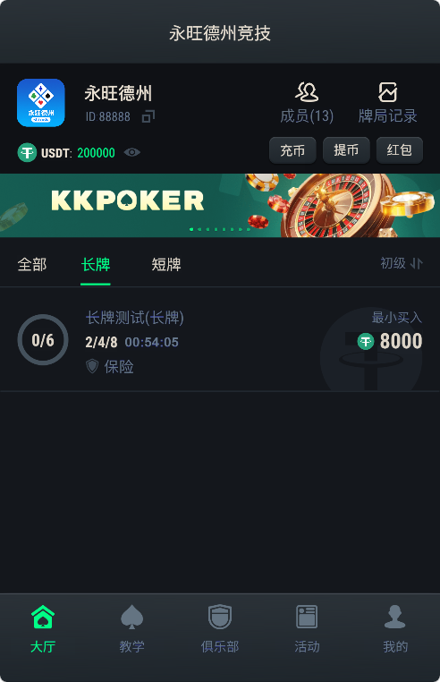
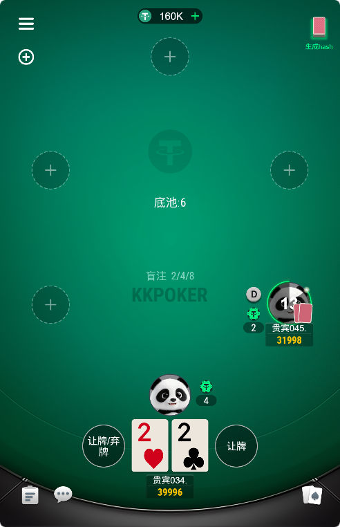
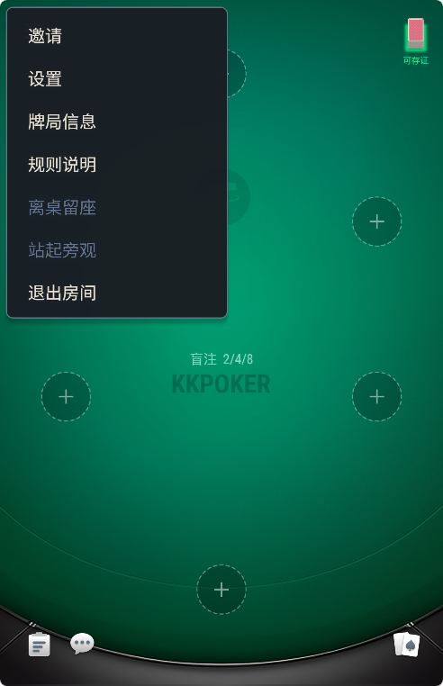
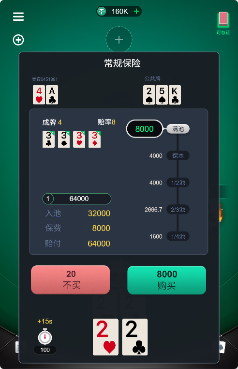
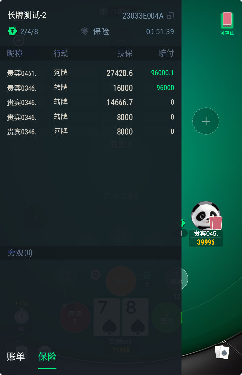
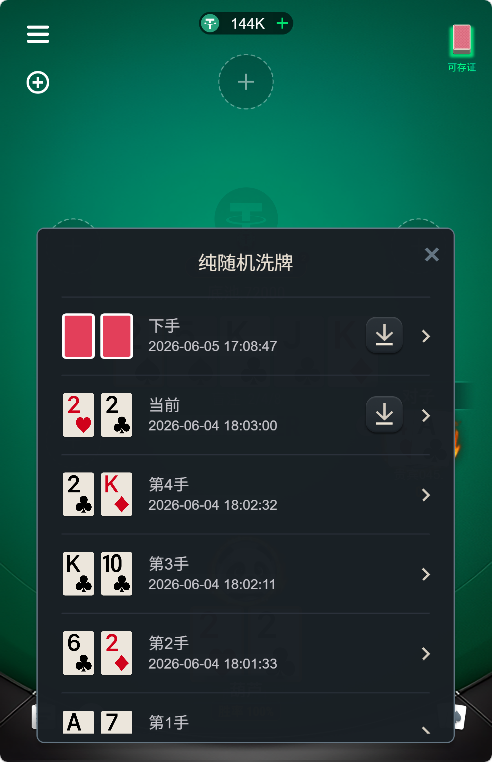
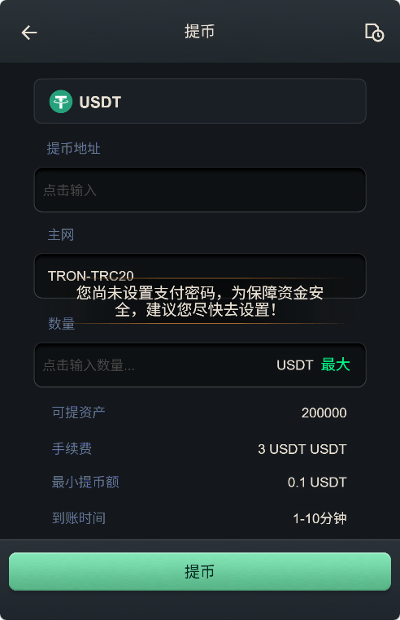
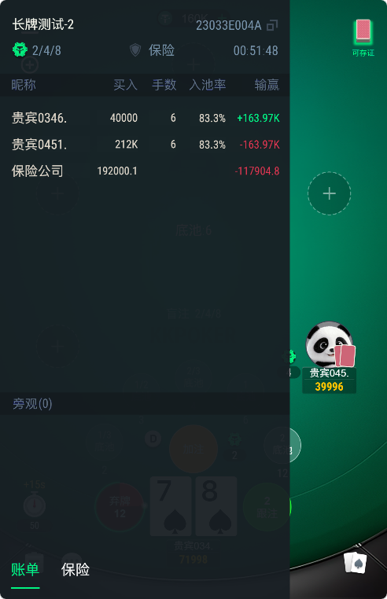
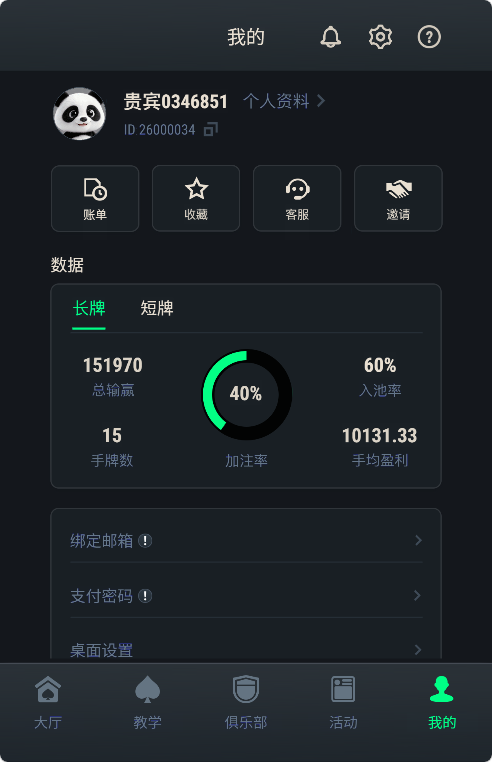
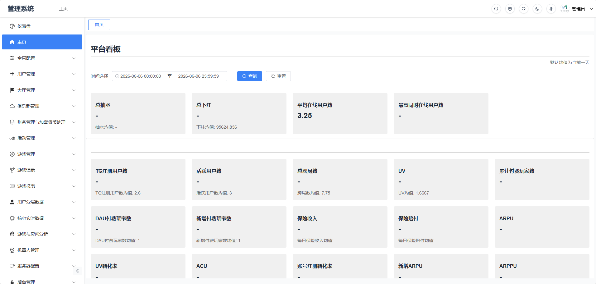

# Texas Hold'em Poker Source Code

[简体中文](README_CN.md)

## Professional Online Poker Platform

Texas Hold'em Poker Source Code is a commercial-grade multiplayer poker platform built for online gaming operators, software companies, and development teams.

The project includes:

- Texas Hold'em Poker
- Tournament System
- Club Management
- Real-Time Multiplayer Architecture
- Cross-Platform Deployment
- Unity Client
- C++ Server

### Contact

Telegram: @xuzongbin001

Email: yueb29266@gmail.com

## Key Features
- Real-time multiplayer poker engine
- Club & community system
- Tournament engine (SNG / MTT)
- Agent & commission system
- Cross-platform support
- Scalable backend architecture

## Technology Stack
Client: Unity3D, C#  
Server: C++, Redis, MySQL, MongoDB  
Network: High-performance real-time socket architecture  

## Architecture
Client → Gateway → Game Services → Data Layer
## 📌 产品截图
<h2 align="center">产品截图</h2>

# Product Demo
## Contact
Telegram: @xuzongbin001
Email：yueb29266@gmail.com
